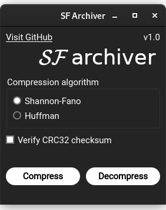

_Архиватор Шеннона-Фано. <br>
Это эксперимент, в котором я делал свой собственный архиватор с алгоритмом Шеннона-Фано.<br>
(Через некоторое время я добавил и алгоритм Хаффмана.)_

Формат сжатого файла представляет собой структуру, состоящую из заголовка, метаданных, таблицы кодов и данных исходного файла в сжатом виде.<br>

## Выберите язык

- [Английский](README.md)
- [Русский](README_ru.md)

## Использованные технологии:
- Работа с бинарными форматами (и язык Kaitai Struct)
- Алгоритмы Хаффмана и Шеннона-Фано
- Графический интерфейс с _PyQT6_
- Интерфейс командной строки с _argparse_
- Использование _pyinstaller_ для сборки EXE
- CI/CD с _GitHub Actions_ (контроль качества кода с [Ruff](https://pypi.org/project/ruff/))

## Установка

Вы можете получить исполняемый файл для Windows со
страницы [releases](https://github.com/Yarosvet/sf_archiver/releases).

Также вы можете собрать его самостоятельно. Просто клонируйте репозиторий:

```bash
git clone https://github.com/Yarosvet/sf_archiver/releases
```

Установите зависимости:

```bash
pip install -r requirements.txt
```

И запустите скрипт:

```bash
python main.py
```

Или, можно собрать его с помощью pyinstaller:

```bash
pip install pyinstaller
pyinstaller --clean sf_archiver.spec
```

## Использование

### CLI

Вы можете использовать этот инструмент из командной строки. Просто запустите скрипт и следуйте инструкциям.

```
usage: sf_archiver [-h] {compress,decompress,gui} ...

Compress and decompress files using SF Archiver

positional arguments:
  {compress,decompress,gui}
                        Mode of operation
    compress            Compress files
    decompress          Decompress files
    gui                 Run GUI

options:
  -h, --help            show this help message and exit
```

По умолчанию, без каких-либо аргументов, будет запущен графический интерфейс.

#### Сжатие с помощью CLI

```
usage: sf_archiver [-h] {compress,decompress,gui} ...

Compress and decompress files using SF Archiver

positional arguments:
  {compress,decompress,gui}
                        Mode of operation
    compress            Compress files
    decompress          Decompress files
    gui                 Run GUI

options:
  -h, --help            show this help message and exit
```

#### Разжатие с помощью CLI

```
usage: sf_archiver decompress [-h] -i INPUT [-o OUTPUT] [-v]

options:
  -h, --help            show this help message and e-xit
  -i INPUT, --input INPUT
                        Input file
  -o OUTPUT, --output OUTPUT
                        Output file or directory (default ./) If no name specified, original name will be used
  -v, --verify          Verify CRC32 checksum stored in compressed file
```

### GUI

Выберите алгоритм сжатия и нажмите соответствующую кнопку.<br>
Настоятельно рекомендуется включить проверку CRC32, чтобы убедиться, что файл был сжат и распакован правильно.



## Исследуйте

Существует спецификация для формата в [sf_kaitai_specification.ksy](sf_kaitai_specification.ksy). Загрузите её
в [Kaitai IDE](https://ide.kaitai.io/), чтобы исследовать структуру сжатого файла.

## Architecture

Проект состоит из следующих модулей:

- `sf_app` - основной пакет
    - `gui` - модуль графического интерфейса пользователя (PyQt6)
    - `cli` - модуль CLI (argparse)
    - `logic` - модуль с основной логикой работы архиватора

Все механизмы связаны между собой контроллером в `sf_app/controllers.py`.

## Алгоритм Шеннона-Фано

Алгоритм Шеннона-Фано - это метод построения префиксного кода на основе набора символов и их вероятностей.<br>
Он используется для сжатия данных без потерь. Алгоритм был независимо предложен Клодом Шенноном и Робертом Фано.

- **Цель:** Создать эффективный двоичный код для набора символов на основе их вероятностей.

**Процесс:**

1. Отсортируйте символы по их вероятностям в порядке убывания.
2. Разделите список на две части, где общие вероятности обеих частей максимально равны.
3. Присвойте каждой части двоичный разряд (0 или 1).
4. Повторяйте процесс рекурсивно для каждой части, пока каждый символ не получит уникальный двоичный код.
   **Пример:**

Даны символы с вероятностями:

- A: 0.4
- B: 0.3
- C: 0.2
- D: 0.1

Алгоритм Шеннона-Фано создаст следующие коды:

- A: 0
- B: 10
- C: 110
- D: 111

**Преимущества:**

- Простой в реализации.
- Обеспечивает префиксный код, что означает, что ни один код не является префиксом другого, обеспечивая однозначное
  декодирование.

**Недостатки:**

- Может не всегда создавать самый оптимальный код по сравнению с кодированием Хаффмана.

## Алгоритм Хаффмана

Алгоритм Хаффмана - это широко используемый метод сжатия данных без потерь. <br>
Он был разработан Дэвидом А. Хаффманом, когда он был аспирантом в MIT, и используется для создания оптимального
префиксного кода на основе частот символов во входных данных.

- **Цель:** Создать эффективный двоичный код для набора символов на основе их частот.

**Процесс:**

1. Подсчитайте частоту каждого символа во входных данных.
2. Создайте приоритетную очередь (минимальную кучу), где каждый узел представляет символ и его частоту.
3. Объедините два узла с наименьшими частотами, чтобы создать новый узел с частотой, равной сумме частот двух узлов.
   Этот новый узел становится родителем двух узлов.
4. Вставьте новый узел обратно в приоритетную очередь.
5. Повторяйте шаги 3 и 4, пока в очереди не останется только один узел. Этот узел становится корнем дерева Хаффмана.
6. Присвойте двоичные коды каждому символу, проходя по дереву Хаффмана от корня к листьям. Присвойте '0' для левых
   ветвей и '1' для правых ветвей.

**Пример:**

Даны символы с частотами:

- A: 5
- B: 9
- C: 12
- D: 13
- E: 16
- F: 45

Алгоритм Хаффмана создаст следующие коды:

- F: 0
- C: 100
- D: 101
- A: 1100
- B: 1101
- E: 111

**Преимущества:**

- Создает оптимальный префиксный код, обеспечивая, что ни один код не является префиксом другого.
- Эффективен для сжатия данных.

**Недостатки:**

- Требует знания частот символов заранее.
- Более сложен в реализации по сравнению с алгоритмом Шеннона-Фано.
